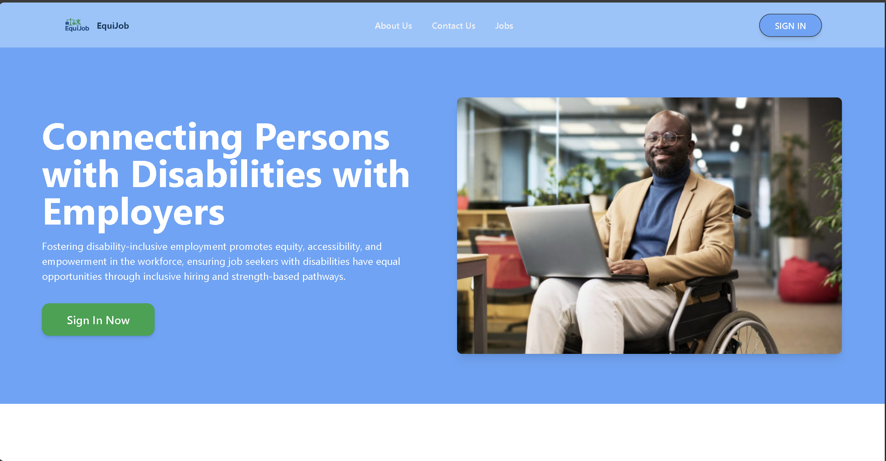
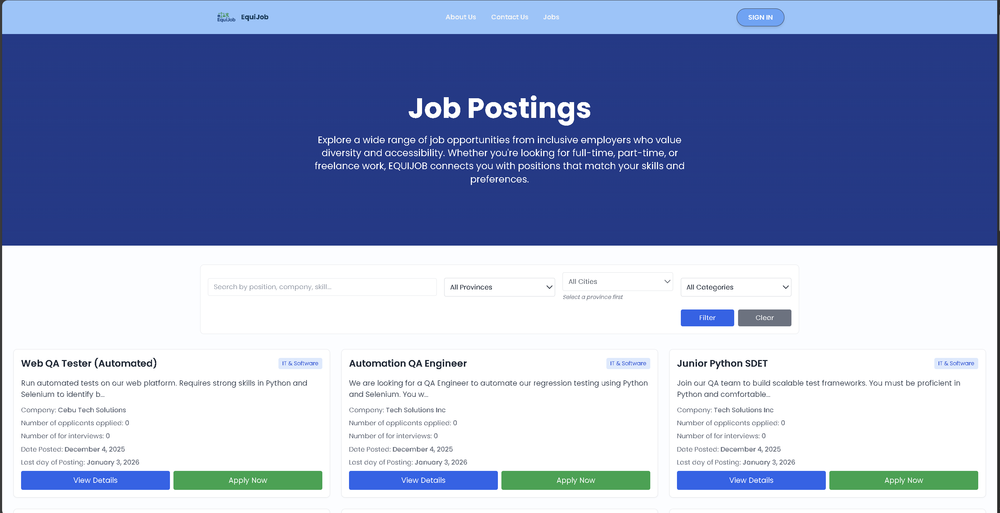
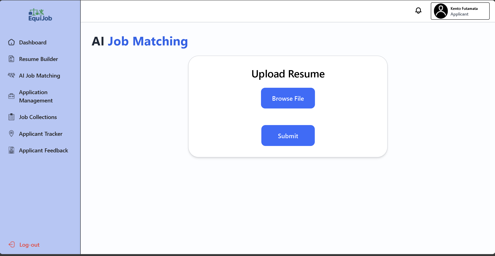
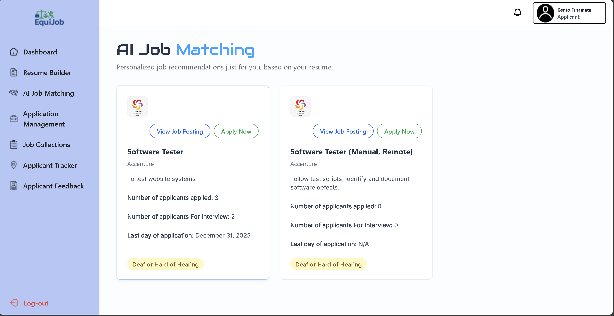
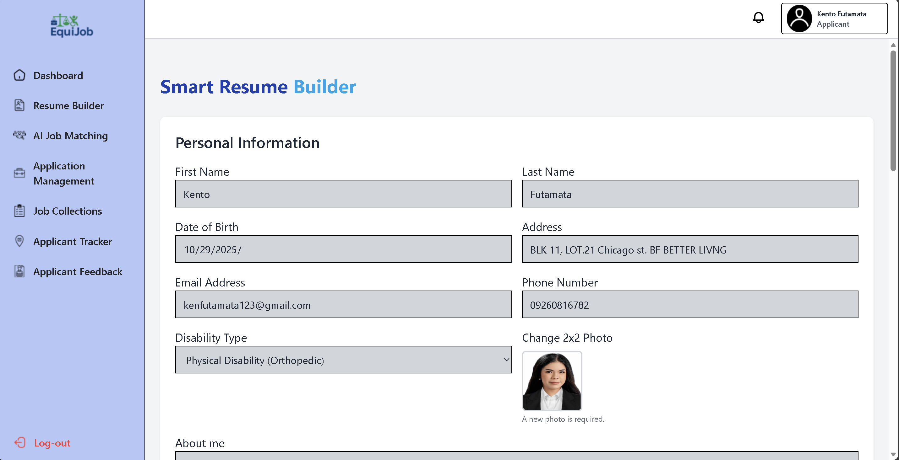
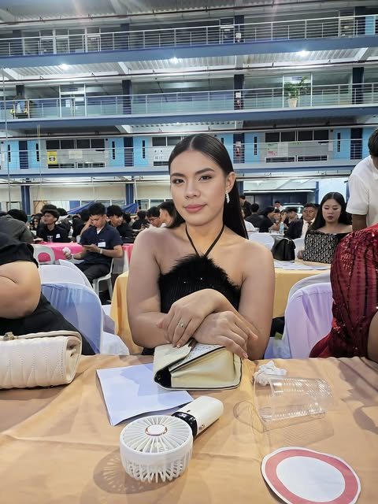
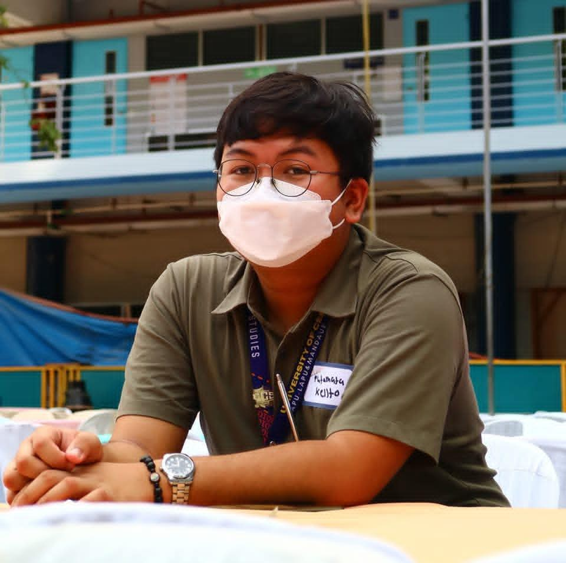
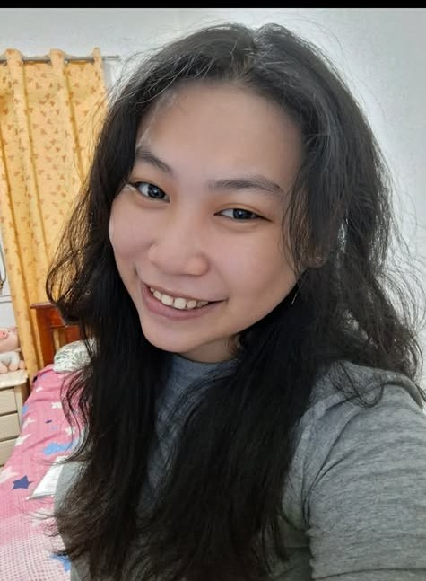

# EQUIJOB

  

<table>
<tr>
<td>
  Our capstone project, EQUIJOB, is an AI-powered web-based platform that we developed to help persons with disabilities find inclusive job opportunities. With EQUIJOB, we aim to make job searching easier by matching PWD job seekers to employers who practice inclusive hiring.
</td>
</tr>
</table>

## Site
EQUIJOB Site Link: https://equijob.up.railway.app/

## Landing Page
The landing page is the main view of the viewers who wish to apply to EQUIJOB

## Main Feature
### AI Job Matching Page

### Smart Resume Builder

## Development
## Technology Stack Used
### Front End

### Backend

### APIs 

## Framework 

## Team

<table align="center">
  <tbody>
    <tr>
      <td align="center" valign="top" width="14.28%">
          
           <b style="color: #50a4f8">Kezekiah R. Yatong</b>
         
            
Project Manager

      </td>
      <td align="center" valign="top" width="14.28%">
          
           <b style = "color: #50a4f8">Kento B. Futamata</b>
         Hacker
      </td>
      <td align="center" valign="top" width="14.28%">
          
           <b style = "color: #50a4f8">Janine C. Alolod</b>
         Hipster
      </td>
      <td align="center" valign="top" width="14.28%">
          
           <b style = "color: #50a4f8">Sara C. Pahara</b>
         Hustler
      </td>
      <td align="center" valign="top" width="14.28%">
          
           <b style = "color:#50a4f8 ">Lance Paul D. Montemar</b>
         Tester
      </td>
    </tr>
  </tbody>
</table>

